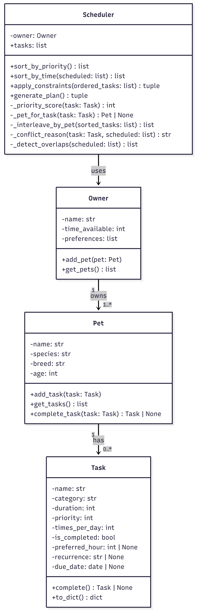

# PawPal+ (Module 2 Project)

You are building **PawPal+**, a Streamlit app that helps a pet owner plan care tasks for their pet.

## Scenario

A busy pet owner needs help staying consistent with pet care. They want an assistant that can:

- Track pet care tasks (walks, feeding, meds, enrichment, grooming, etc.)
- Consider constraints (time available, priority, owner preferences)
- Produce a daily plan and explain why it chose that plan

Your job is to design the system first (UML), then implement the logic in Python, then connect it to the Streamlit UI.

## What you will build

Your final app should:

- Let a user enter basic owner + pet info
- Let a user add/edit tasks (duration + priority at minimum)
- Generate a daily schedule/plan based on constraints and priorities
- Display the plan clearly (and ideally explain the reasoning)
- Include tests for the most important scheduling behaviors

## UML Diagram



## Smarter Scheduling

The scheduling engine goes beyond a simple priority sort. Here is what it does and why.

### 1. Preference-aware priority scoring
Every task is ranked by an effective priority score rather than its raw value. If a task's category (e.g. `"meds"`, `"walk"`) appears in the owner's preference list it receives a +1 bonus, breaking ties in favour of care types the owner has explicitly flagged as important.

### 2. Fair pet representation (round-robin interleaving)
Before the time budget is applied, tasks are reordered round-robin by pet. Pet 1's top task goes first, then pet 2's top task, then back to pet 1's second task, and so on. This prevents a pet with uniformly high-priority tasks from filling the entire day and leaving another pet with no scheduled care.

### 3. Recurring task expansion
Each task carries a `times_per_day` field. Before greedy scheduling runs, the task list is expanded so a task due three times a day occupies three slots and consumes its full share of the time budget — rather than being counted only once.

### 4. Completed-task filtering
Tasks already marked `is_completed` are silently skipped during scheduling. Marking a one-off task complete removes it from future plans. Marking a recurring task complete (via `Pet.complete_task()`) automatically creates the next occurrence with its due date advanced by `timedelta(days=1)` for daily tasks or `timedelta(weeks=1)` for weekly ones.

### 5. Clock-ordered output (`sort_by_time`)
After the budget pass, the scheduled tasks are sorted by `preferred_hour` (0–23) so the final plan reads as a real daily timeline. Tasks with no preferred hour are placed at the end.

### 6. Deferred task reporting
Tasks that do not fit the time budget are returned in a separate `deferred` list alongside a human-readable reason. Two reason types are possible:
- `"time budget exceeded"` — the cumulative duration of higher-priority tasks left no room.
- `"priority conflict with <pet>'s '<task>'"` — a task from a different pet with the same effective priority was scheduled first, squeezing this one out.

### 7. Time-overlap detection (`_detect_overlaps`)
After sorting by time, every pair of scheduled tasks with a `preferred_hour` is checked for window collisions using the interval overlap condition `a.start < b.end and b.start < a.end`. Each collision produces a named warning that identifies both pets, both tasks, and the exact HH:MM windows — for example:

```
WARNING: Dooshtu's 'Morning Walk' (07:00-07:30) overlaps with Booshtu's 'Medication' (07:00-07:05)
```

Overlaps are returned as a third value from `generate_plan()` and displayed in the Streamlit UI as `st.warning()` banners so the owner can reschedule one of the conflicting tasks.

---

## Testing PawPal+

### Run the tests

```bash
python -m pytest tests/test_pawpal.py -v
```

### What the tests cover

| Area | Tests |
|---|---|
| **Edge cases** | Pet with no tasks, scheduler with no pets, scheduler whose pets have no tasks |
| **Sorting correctness** | Tasks returned in chronological order by `preferred_hour`; untimed tasks placed at the end; two tasks at the same hour both appear in the result |
| **Recurrence logic** | Daily task produces a next-day task on completion; weekly task advances by 7 days; one-off task returns `None`; `Pet.complete_task()` appends the next occurrence automatically; `due_date=None` defaults to today |
| **Conflict detection** | Two tasks at the exact same hour are flagged as overlapping; partial window overlap is caught; non-overlapping tasks produce no warnings; untimed tasks are excluded from overlap detection; warning messages name the conflicting tasks |

19 tests — 19 passing.

### Confidence level

**4 / 5 stars**

The core scheduling behaviors — sorting, recurrence, and overlap detection — are each tested through multiple scenarios including boundary conditions (same start time, no due date, no tasks at all). The logic holds up well against the cases most likely to cause real-world bugs. One star is withheld because the tests do not yet cover multi-pet priority interleaving (`_interleave_by_pet`), the owner-preference scoring bonus, or the deferred-task conflict reason strings — behaviors that involve more complex interactions between components and would benefit from dedicated integration-style tests.

---

## Getting started

### Setup

```bash
source ~/.venv/Scripts/activate
uv pip install -r requirements.txt
```

### Suggested workflow

1. Read the scenario carefully and identify requirements and edge cases.
2. Draft a UML diagram (classes, attributes, methods, relationships).
3. Convert UML into Python class stubs (no logic yet).
4. Implement scheduling logic in small increments.
5. Add tests to verify key behaviors.
6. Connect your logic to the Streamlit UI in `app.py`.
7. Refine UML so it matches what you actually built.
